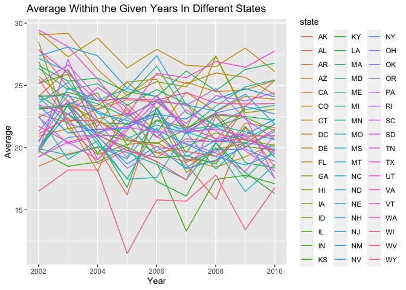

p8105_hw3_yz4717
================
Yang Zhao - yz4717
2023-10-09

``` r
library(tidyverse)
```

    ## ── Attaching core tidyverse packages ──────────────────────── tidyverse 2.0.0 ──
    ## ✔ dplyr     1.1.3     ✔ readr     2.1.4
    ## ✔ forcats   1.0.0     ✔ stringr   1.5.0
    ## ✔ ggplot2   3.4.3     ✔ tibble    3.2.1
    ## ✔ lubridate 1.9.2     ✔ tidyr     1.3.0
    ## ✔ purrr     1.0.2     
    ## ── Conflicts ────────────────────────────────────────── tidyverse_conflicts() ──
    ## ✖ dplyr::filter() masks stats::filter()
    ## ✖ dplyr::lag()    masks stats::lag()
    ## ℹ Use the conflicted package (<http://conflicted.r-lib.org/>) to force all conflicts to become errors

``` r
library(p8105.datasets) 
data("brfss_smart2010")

knitr::opts_chunk$set(
  fig.width = 6,
  fig.asp = .6
)
```

``` r
dict_resp = c("Poor",
              "Fair",
              "Good",
              "Very good",
              "Excellent")

brfss_df = brfss_smart2010 |> 
  janitor::clean_names() |> 
  filter(topic == "Overall Health" & response %in% dict_resp) |> 
  mutate(
    response,
    response = factor(
      response,
      levels = dict_resp,
      ordered = TRUE)) |> 
  mutate(state = locationabbr,
         county = locationdesc)

brfss_df |> head()
```

    ## # A tibble: 6 × 25
    ##    year locationabbr locationdesc      class topic question response sample_size
    ##   <int> <chr>        <chr>             <chr> <chr> <chr>    <ord>          <int>
    ## 1  2010 AL           AL - Jefferson C… Heal… Over… How is … Excelle…          94
    ## 2  2010 AL           AL - Jefferson C… Heal… Over… How is … Very go…         148
    ## 3  2010 AL           AL - Jefferson C… Heal… Over… How is … Good             208
    ## 4  2010 AL           AL - Jefferson C… Heal… Over… How is … Fair             107
    ## 5  2010 AL           AL - Jefferson C… Heal… Over… How is … Poor              45
    ## 6  2010 AL           AL - Mobile Coun… Heal… Over… How is … Excelle…          91
    ## # ℹ 17 more variables: data_value <dbl>, confidence_limit_low <dbl>,
    ## #   confidence_limit_high <dbl>, display_order <int>, data_value_unit <chr>,
    ## #   data_value_type <chr>, data_value_footnote_symbol <chr>,
    ## #   data_value_footnote <chr>, data_source <chr>, class_id <chr>,
    ## #   topic_id <chr>, location_id <chr>, question_id <chr>, respid <chr>,
    ## #   geo_location <chr>, state <chr>, county <chr>

``` r
result_2002 = brfss_df |> 
  filter(year == 2002) |> 
  distinct(state,county)|>  
  count(state) |> 
  filter(n>=7) |> 
  pull(state)

result_2010 = brfss_df |> 
  filter(year == 2010)|> 
  distinct(state,county) |> 
  count(state) |> 
  filter(n>=7) |> 
  pull(state)
```

``` r
excellent = brfss_df |>
  filter(response == "Excellent") |> 
  select(year,state,data_value) |> 
  group_by(state,year) |> 
  summarize(mean = mean(data_value))  
```

    ## `summarise()` has grouped output by 'state'. You can override using the
    ## `.groups` argument.

``` r
excellent |> 
  ggplot(aes(x = year,y = mean, group = state,color = state)) + 
  geom_line()
```

    ## Warning: Removed 3 rows containing missing values (`geom_line()`).

<!-- -->

``` r
ny_distri_df = 
  brfss_df |>  
  filter(year == 2006 | year == 2010 ) |> 
  filter(state == "NY")

ny_distr_plot=
  ny_distri_df |> 
  ggplot(aes(x=response,y = data_value))+
  geom_boxplot() +
  facet_wrap(.~year)
```

``` r
covar_df = 
  read_csv("Data/nhanes_covar.csv",skip = 4) |> 
  janitor::clean_names() |> 
  mutate(sex = recode(sex, '1' = 'male', '2' = 'female')) |> 
  mutate(education = case_match(education,
                                1~"less than high school",
                                2~"high school equivalent",
                                3~"more than high school")) |> 
  filter(age>=21) |> 
  drop_na() |> 
  relocate(seqn,sex,education)
```

    ## Rows: 250 Columns: 5
    ## ── Column specification ────────────────────────────────────────────────────────
    ## Delimiter: ","
    ## dbl (5): SEQN, sex, age, BMI, education
    ## 
    ## ℹ Use `spec()` to retrieve the full column specification for this data.
    ## ℹ Specify the column types or set `show_col_types = FALSE` to quiet this message.

``` r
accel_df = 
  read_csv("Data/nhanes_accel.csv") |> 
  janitor::clean_names() |> 
  pivot_longer(min1:min1440,
               names_to = "time_mark",
               values_to = "values")
```

    ## Rows: 250 Columns: 1441
    ## ── Column specification ────────────────────────────────────────────────────────
    ## Delimiter: ","
    ## dbl (1441): SEQN, min1, min2, min3, min4, min5, min6, min7, min8, min9, min1...
    ## 
    ## ℹ Use `spec()` to retrieve the full column specification for this data.
    ## ℹ Specify the column types or set `show_col_types = FALSE` to quiet this message.

``` r
catergoried_mw_edu = covar_df |> 
  group_by(sex, education) |> 
  tally()
```
