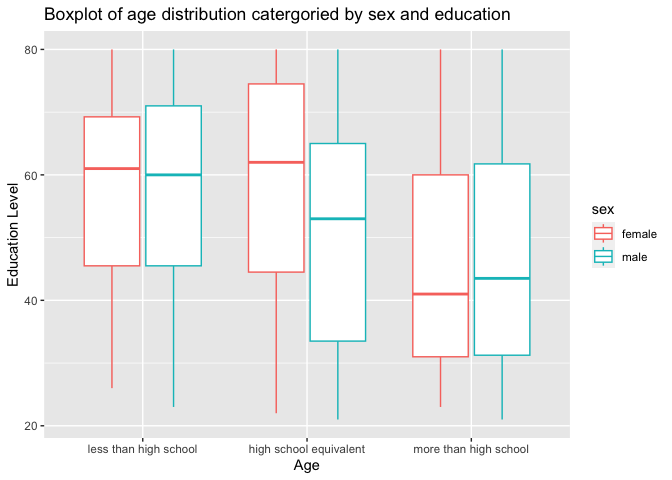

p8105_hw3_yz4717
================
Yang Zhao - yz4717
2023-10-09

``` r
library(tidyverse)
```

    ## ── Attaching core tidyverse packages ──────────────────────── tidyverse 2.0.0 ──
    ## ✔ dplyr     1.1.3     ✔ readr     2.1.4
    ## ✔ forcats   1.0.0     ✔ stringr   1.5.0
    ## ✔ ggplot2   3.4.3     ✔ tibble    3.2.1
    ## ✔ lubridate 1.9.2     ✔ tidyr     1.3.0
    ## ✔ purrr     1.0.2     
    ## ── Conflicts ────────────────────────────────────────── tidyverse_conflicts() ──
    ## ✖ dplyr::filter() masks stats::filter()
    ## ✖ dplyr::lag()    masks stats::lag()
    ## ℹ Use the conflicted package (<http://conflicted.r-lib.org/>) to force all conflicts to become errors

``` r
library(p8105.datasets) 
library(ggplot2)
```

First of all, I import all the needed packages into the environment.

## Question 2

``` r
data("brfss_smart2010")

dict_resp = c("Poor",
              "Fair",
              "Good",
              "Very good",
              "Excellent")

brfss_df = brfss_smart2010 |> 
  janitor::clean_names() |> 
  filter(topic == "Overall Health" & response %in% dict_resp) |> 
  mutate(
    response,
    response = factor(
      response,
      levels = dict_resp,
      ordered = TRUE)) |> 
  mutate(state = locationabbr,
         county = locationdesc)

brfss_df |> head()
```

    ## # A tibble: 6 × 25
    ##    year locationabbr locationdesc      class topic question response sample_size
    ##   <int> <chr>        <chr>             <chr> <chr> <chr>    <ord>          <int>
    ## 1  2010 AL           AL - Jefferson C… Heal… Over… How is … Excelle…          94
    ## 2  2010 AL           AL - Jefferson C… Heal… Over… How is … Very go…         148
    ## 3  2010 AL           AL - Jefferson C… Heal… Over… How is … Good             208
    ## 4  2010 AL           AL - Jefferson C… Heal… Over… How is … Fair             107
    ## 5  2010 AL           AL - Jefferson C… Heal… Over… How is … Poor              45
    ## 6  2010 AL           AL - Mobile Coun… Heal… Over… How is … Excelle…          91
    ## # ℹ 17 more variables: data_value <dbl>, confidence_limit_low <dbl>,
    ## #   confidence_limit_high <dbl>, display_order <int>, data_value_unit <chr>,
    ## #   data_value_type <chr>, data_value_footnote_symbol <chr>,
    ## #   data_value_footnote <chr>, data_source <chr>, class_id <chr>,
    ## #   topic_id <chr>, location_id <chr>, question_id <chr>, respid <chr>,
    ## #   geo_location <chr>, state <chr>, county <chr>

First, I imported the data into the environment. The ‘clean_names()’
function is applied to ensure that the column names of the data frame
are clean and standardized. Subsequently, I used the `filter` function
to extract rows from the data frame where the ‘topic’ equal to “Overall
Health” and the ‘response’ column contains any of the predefined
health-related responses in the dict_resp . The subsequent mutate
function is employed to create a new column called ‘response’ and
converts it into an ordered factor, arranging the levels based on the
predefined values in the dict_resp vector. Additionally, another mutate
function change the name of `locationabbr` and `locationdesc` variables
into `state` and `county` respectively. These operations essentially
modifies and filters the data frame, preparing it for analysis and
visualization based on the specified health-related responses and
related geographical information.

``` r
result_2002 = brfss_df |> 
  filter(year == 2002) |> 
  distinct(state,county)|>  
  count(state) |> 
  filter(n>=7) |> 
  pull(state)

result_2010 = brfss_df |> 
  filter(year == 2010)|> 
  distinct(state,county) |> 
  count(state) |> 
  filter(n>=7) |> 
  pull(state)
```

Then, I used the function `filter` to select the observations in a
specific year . Then, I keep only unique rows from the given data by the
variable of state and county. And I picked out all the states which
appears more than 7 times after counting the state. At last, I use the
`pull` functin to show all states which meets the requirement.

Based on the result I have, I have these comments: \* In the year of
2002, there are 6 states which were observed at 7 or more locations:CT,
FL, MA, NC, NJ, PA.

- In the year of 2010, there are14 states which were observed at 7 or
  more locations:CA, CO, FL, MA, MD, NC, NE, NJ, NY, OH, PA, SC, TX, WA.

The following plot is going to show the average value of the people who
gave the excellent response in each state from the year of 2002 to the
year of 2010.

``` r
excellent = brfss_df |>
  filter(response == "Excellent") |> 
  select(year,state,data_value) |> 
  group_by(state,year) |> 
  summarize(mean = mean(data_value))  
```

    ## `summarise()` has grouped output by 'state'. You can override using the
    ## `.groups` argument.

``` r
excellent |> 
  ggplot(aes(x = year,y = mean, group = state,color = state)) + 
  geom_line()+
  labs(x = "Year",
    y = "Average",
    title = "Average Within the Given Years In Different States")
```

    ## Warning: Removed 3 rows containing missing values (`geom_line()`).

<!-- -->

The

``` r
ny_distri_df = 
  brfss_df |>  
  filter(year == 2006 | year == 2010 ) |> 
  filter(state == "NY")

ny_distri_df |> head()
```

    ## # A tibble: 6 × 25
    ##    year locationabbr locationdesc      class topic question response sample_size
    ##   <int> <chr>        <chr>             <chr> <chr> <chr>    <ord>          <int>
    ## 1  2010 NY           NY - Bronx County Heal… Over… How is … Excelle…          61
    ## 2  2010 NY           NY - Bronx County Heal… Over… How is … Very go…         105
    ## 3  2010 NY           NY - Bronx County Heal… Over… How is … Good             151
    ## 4  2010 NY           NY - Bronx County Heal… Over… How is … Fair              86
    ## 5  2010 NY           NY - Bronx County Heal… Over… How is … Poor              31
    ## 6  2010 NY           NY - Erie County  Heal… Over… How is … Excelle…          69
    ## # ℹ 17 more variables: data_value <dbl>, confidence_limit_low <dbl>,
    ## #   confidence_limit_high <dbl>, display_order <int>, data_value_unit <chr>,
    ## #   data_value_type <chr>, data_value_footnote_symbol <chr>,
    ## #   data_value_footnote <chr>, data_source <chr>, class_id <chr>,
    ## #   topic_id <chr>, location_id <chr>, question_id <chr>, respid <chr>,
    ## #   geo_location <chr>, state <chr>, county <chr>

``` r
ny_distri_df |> 
  ggplot(aes(x=response,y = data_value))+
  geom_boxplot() +
  facet_wrap(.~year)+
  labs(title = "Distribution of the Data in 2006 and 2010")
```

<!-- -->

- Comment:In the boxplot I got, the frequency of `poor` is the lowest in
  both years. Apart from that, the answer of `Very good` appeared most
  frequent. However, the “good” response is the second most frequent
  response.

## Question 3

``` r
q3_factor_order = c(
  "less than high school",
  "high school equivalent",
  "more than high school"
)

covar_df = 
  read_csv("Data/nhanes_covar.csv",skip = 4) |> 
  janitor::clean_names() |> 
  mutate(sex = recode(sex, '1' = 'male', '2' = 'female')) |> 
  mutate(education = case_match(education,
                                1~"less than high school",
                                2~"high school equivalent",
                                3~"more than high school")) |> 
  filter(age>=21) |> 
  drop_na() |> 
  mutate(education = factor(education,
                            levels = q3_factor_order,
                            ordered = TRUE)) |> 
  relocate(seqn,sex,education)
```

    ## Rows: 250 Columns: 5
    ## ── Column specification ────────────────────────────────────────────────────────
    ## Delimiter: ","
    ## dbl (5): SEQN, sex, age, BMI, education
    ## 
    ## ℹ Use `spec()` to retrieve the full column specification for this data.
    ## ℹ Specify the column types or set `show_col_types = FALSE` to quiet this message.

First of all, to make the code much more clear, I made a list of the
education factor with the order. Then, I encoded the variable with
reasonable classes as you can see in the code, and dropped all the `NA`
in the data. To meet up the requirement, I also used the `filter`
function to select the observations which is `21+`.

``` r
accel_df = 
  read_csv("Data/nhanes_accel.csv") |> 
  janitor::clean_names() |> 
  pivot_longer(min1:min1440,
               names_to = "time_mark",
               values_to = "values") |> 
  mutate(time_mark = substring(time_mark,first = 4),
         time_mark = as.numeric(time_mark),) 
```

    ## Rows: 250 Columns: 1441
    ## ── Column specification ────────────────────────────────────────────────────────
    ## Delimiter: ","
    ## dbl (1441): SEQN, min1, min2, min3, min4, min5, min6, min7, min8, min9, min1...
    ## 
    ## ℹ Use `spec()` to retrieve the full column specification for this data.
    ## ℹ Specify the column types or set `show_col_types = FALSE` to quiet this message.

Then, I also cleaned the `nhanes_accel.csv`. Using the `clean_names` as
usual, I convert all the uppercase letters within the names of variables
into lowercase. After that, I convert the data into longer format and
clean the characters `min` in all the `time_mark` classes to make it
into a reader-friendly data frame.

``` r
catergoried_mw_edu = covar_df |> 
  group_by(sex, education) |> 
  tally() |> 
  pivot_wider(
    names_from = sex,
    values_from = n
  ) |> knitr::kable(
    caption = "Summary of the total muber of people in")

print(catergoried_mw_edu)
```

    ## 
    ## 
    ## Table: Summary of the total muber of people in
    ## 
    ## |education              | female| male|
    ## |:----------------------|------:|----:|
    ## |less than high school  |     28|   27|
    ## |high school equivalent |     23|   35|
    ## |more than high school  |     59|   56|

As you can see from the table above, you can clear see the sample size
in these different catergories.

``` r
covar_df |> 
  ggplot(aes(x = education,y = age,color = sex))+
  geom_boxplot() +
  labs(title ="Boxplot of age distribution catergoried by sex and education" )
```

<!-- -->

- Comments: By comparing the age ranges of all the samples, it can be
  seen that all the samples cover relatively similar age ranges.
  cosidering the whole distribution, the data of `female` nearly shares
  a same distribution with the data of `male` in both the group of
  `less than high school` and `more than high school` separately. In the
  section of `male`, when the education level becomes higher, the mean
  age of the male’s group becomes younger gradually when the education
  level becomes higher. In the section of `female`, for the group of
  `lower than high school` and `equivalent to high school groups`, the
  mean age are similar, which is way higher than the average age of the
  group of `higher than high school`.

``` r
total_activity_df = accel_df |> 
  group_by(seqn) |> 
  summarise(total_activity = sum(values))

joint_sum_df = left_join(covar_df,total_activity_df,by = "seqn")

joint_sum_df |> 
  ggplot(aes(x = age , y = total_activity, color = sex, se = TRUE))+
  geom_point()+
  geom_smooth()+
  facet_grid(.~education)+
  labs(title = "Age - Total Activities by Sex and Education Level")
```

    ## `geom_smooth()` using method = 'loess' and formula = 'y ~ x'

<!-- -->

- Comments: It’s clear that the graph mainly shows the difference
  between three different education levels. In the graph of
  `less than high school`, females’ total activity is higher than male
  before the age of 40. After that, female’s total activity will drop
  faster than males did. While in the graph of `high school equivalent`
  and the graph of `more than high school`, the females’ total activity
  is higher than males nearly at all ages and they peaks ar the age of
  48 in both sex groups. Above three graphs, they all showed a downward
  trend in both male and female group, in other words, as they became
  older, the total activity will drop gradually.

``` r
minutes = left_join(covar_df,accel_df,by = join_by("seqn")) 

minutes |>
  ggplot(aes(x = time_mark, y = values, color = sex)) +
  geom_line(alpha = 0.2) +
  geom_smooth(aes(group = sex), se = FALSE) +
  facet_wrap(~ education) +
  labs(x = "Time(minutes) in a Day", y = "MIMS",
       title = "Activity over 24 Hours catergorized by Sex and Education Level") 
```

    ## `geom_smooth()` using method = 'gam' and formula = 'y ~ s(x, bs = "cs")'

<!-- -->

- Comments: It’s clear that the data of female and male in all education
  level shares a same pattern in trend of `MIMS`. However, in the group
  of `more than high school`, it contains more outliers than the others,
  in other words, MIMS data in this education level is more volatile.
  Otherwise, the first two groups are less volatile, with more similar
  fluctuations.
